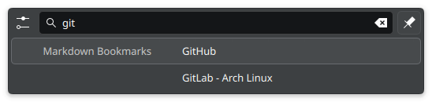

# krunner-markdown-bookmarks
A KRunner plugin for opening web links listed in a Markdown file



```
# Bookmarks
## Code
- [GitHub](https://github.com)
- [GitLab - Arch Linux](https://gitlab.archlinux.org)
## Social
- [Hacker News](https://news.ycombinator.com)
- [Reddit](https://www.reddit.com)
```

## Installation
- [Arch Linux AUR](https://aur.archlinux.org/packages/plasma6-runners-markdown-bookmarks)

## Acknowledgements
- [alex1701c/Emojirunner](https://github.com/alex1701c/EmojiRunner) for being the basis of this plugin.
