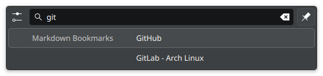

# krunner-markdown-bookmarks
A KRunner plugin for opening web links and search engines from Markdown files



### Bookmarks file

Configure a markdown file with `[title](url)` links. Search in KRunner by typing part of the bookmark name.

```markdown
# Bookmarks

## Code
- [GitHub](https://github.com)
- [GitLab - Arch Linux](https://gitlab.archlinux.org)
- [Rust Docs](https://doc.rust-lang.org/std)

## Social
- [Hacker News](https://news.ycombinator.com)
- [Reddit](https://www.reddit.com)

## Reference
- [Arch Wiki](https://wiki.archlinux.org)
- [KDE Developer Docs](https://develop.kde.org)
```

### Search engines file

Configure a separate markdown file with search engine entries. Each entry is a `[name](url)` link where the URL contains `{}` as a query placeholder, followed by `` `keywords` `` in backticks.

Trigger a search in KRunner with `!keyword query` (bang can appear anywhere in the query).

```markdown
# Search Engines

## General
- [Google](https://www.google.com/search?q={}&udm=14) `google, g`
- [DuckDuckGo](https://duckduckgo.com/?q={}) `duckduckgo, ddg`
- [Wikipedia](https://en.wikipedia.org/w/index.php?search={}) `wikipedia, wiki, w`

## Development
- [GitHub](https://github.com/search?q={}&type=repositories) `github, gh`
- [Arch Wiki](https://wiki.archlinux.org/index.php?search={}) `archwiki, aw`
- [Crates.io](https://crates.io/search?q={}) `crates`

## Media
- [YouTube](https://www.youtube.com/results?search_query={}) `youtube, yt`
```

Examples:
- `!yt cat videos` — search YouTube for "cat videos"
- `cat videos !yt` — same result (bang can appear anywhere)
- `!wiki rust programming` — search Wikipedia
- `!gh krunner plugin` — search GitHub repositories

## Installation
- [Arch Linux AUR](https://aur.archlinux.org/packages/plasma6-runners-markdown-bookmarks)

## Acknowledgements
- [alex1701c/Emojirunner](https://github.com/alex1701c/EmojiRunner) for being the basis of this plugin.
